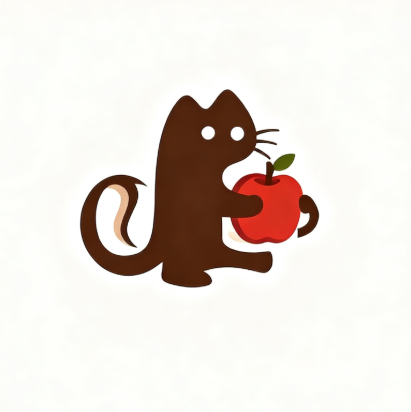

  
  <h1>Fruit Guardians</h1>
  
<strong>聚焦安全研究 · 沉淀实战能力 · 守护数字世界</strong>

---

## 关于我们

**Fruit Guardians（果宝特攻）** 是由 [HnuSec](https://www.hnusec.com) 发起和维护的网络安全开源项目计划。

我们深耕攻防对抗与安全研究，覆盖漏洞挖掘、逆向分析、Web 安全、二进制利用等核心方向，将 HnuSec 历届培训积累和比赛实战中真正有价值的能力，沉淀为可复用的工具、脚本与技术文档，持续向社区开放。

---

## 研究方向

<table>
<tr>
<td width="50%" valign="top">

**攻防研究**
- Web 漏洞挖掘与利用
- 二进制逆向与 Pwn
- 密码学分析
- 流量分析与取证

</td>
<td width="50%" valign="top">

**工程建设**
- 安全工具开发与自动化
- 漏洞复现与 PoC 整理
- CTF 题解与技巧沉淀
- 攻防知识库建设

</td>
</tr>
</table>

---

## 资料归档

本组织同时承担 **HnuSec 历届培训与比赛记录**的沉淀与归档工作：

- **培训资料**：历届新生培训、专项技术培训的课件、笔记与配套练习
- **比赛记录**：国内外 CTF 赛事的参赛记录、WriteUp 与赛后总结
- **知识积累**：各方向研究笔记、工具使用手册与攻防经验

---

## 如何参与

| 身份 | 参与方式 |
|------|----------|
| 安全初学者 | 浏览培训资料，从文档和练习入手，逐步融入实战 |
| 安全研究者 | 贡献研究成果、工具或 WriteUp，扩展知识边界 |
| 开发者 | 将工具集成到安全工作流，提升效率与质量 |

- 浏览仓库：[Repositories](https://github.com/orgs/Fruit-Guardians/repositories)
- 提交反馈：[Discussions](https://github.com/orgs/Fruit-Guardians/discussions)
- 贡献代码：Fork → 创建分支 → 提交 PR

---

## 团队成员

  感谢每一位为 Fruit Guardians 持续投入时间、创意与代码的成员。
    

---

  <strong>Fruit Guardians · 用开源工具沉淀安全能力，用工程实践守护数字世界</strong>
   
  官网 <a href="https://www.hnusec.com">hnusec.com</a> · 一起见证星辰大海

